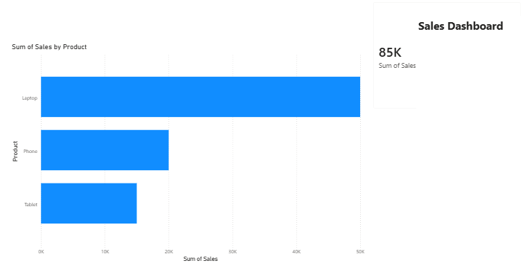

# 📊 Data Analytics Portfolio

Hi, I'm **Abhayjith A**, a Computer Science graduate aspiring to build my career as a **Data Analyst**.

I work with **SQL, Python, Excel, and Power BI** to clean, analyze, visualize, and transform data into meaningful business insights.

### 🛠️ Core Skills

**SQL** · **Python** · **Excel** · **Power BI** · **Pandas** · **DAX** · **Power Query** · **Data Visualization** · **Data Analysis**

---

## ⭐ Featured Project

### 📈 Sales Dashboard Analysis

An end-to-end retail analytics project covering the complete analytics workflow:

**SQL → Python → Excel → Power BI → Business Insights**

The project includes:

- Revenue and sales trend analysis
- Product performance and profitability
- Regional and category analysis
- Customer insights
- KPI development
- DAX measures
- Interactive Power BI dashboards

### 🔗 [View the Full Sales Dashboard Analysis Project](https://github.com/abhayjith17-aj/Sales-Dashboard-Analysis)

---

---

# SQL Project

File:
- SQL/sales_analysis.sql

Skills:
- SELECT
- GROUP BY
- ORDER BY
- Aggregate Functions

---

# Python Project

File:
- Python/sales_analysis_python.ipynb

Skills:
- Pandas
- DataFrames
- Data Analysis

---

# Power BI Dashboard

Dashboard Screenshot:

Files:
- PowerBI/sales_dashboard.pbix

Skills:
- KPI Dashboard
- Visualization
- Charts
